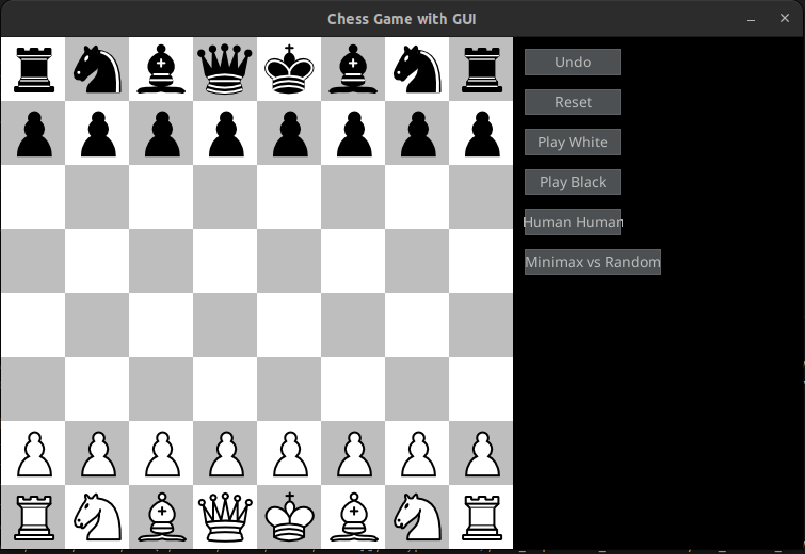

# Chess Game - Assignment 2 - Introduction to AI

## Team:

| Name              | ID        | Role                    |
|-------------------|-----------|-------------------------|
| Nguyen Trong Anh  | 2110014   | Game engine, GUI        |
| Nguyen Huu Chien  | 2110855   | Game engine             |
| Lam Quan Trung    | 2110855   | GUI, minimax algo       |
| Nguyen Phan Dinh Huy | 2211228   | GUI, minimax algo       |
 

## Overview

This is a basic implementation of a chess game built as part of Assignment 2 for the course *Introduction to Artificial Intelligence*. The project includes:

- A working chess engine
- A graphical user interface (GUI) built with `pygame`
- Basic move validation and rule enforcement

## Features

- Standard chess rules implemented
- Visual chessboard with draggable pieces
- Turn-based gameplay
- AI move generation (current using minimax)

## Getting Started

### Requirements

- Python 3.8+
- `pygame` library
- `pygame-gui` library

## Running 

### Play game with GUI 

```
python chess-game-AI-main/main_gui.py
```
The GUI of game as:



We develop some button for advanced function:

- `Undo move`: To undo the recent move 
- `Reset`: Reset to the init game 
- `Play white`: You will play the white, and the minimax agent will play the black
- `Play black`: You will play the black, and the minimax agent will play the white
- `Human Human`: Human mode, to enjoy game with your friend !
- `Minimax vs Random`: Demo the minimax (white) and Random (black) moves 

### Evalutate the minimax agent vs random agent 

```
python chess-game-AI-main/evaluate.py
```

In the main function of evaluation, you can choose the depth of minimax (must be larger than 2) and num of game
```
    evaluate_agents(num_games=10, agent_depth_1=3)
```
We strongly suggest to keep the number of games is less or equal than 10 and depth of minimax agent from 2 -> 4 to save computation.